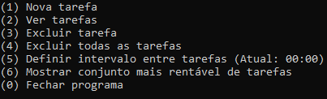
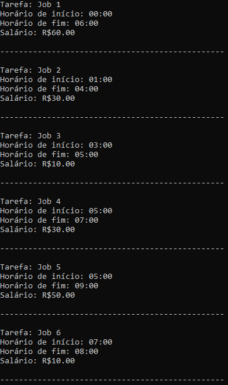
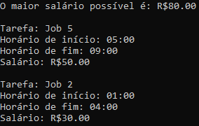

# Maior Renda

**Número da Lista**: 5<br>
**Conteúdo da Disciplina**: Programação Dinâmica<br>

## Alunos
| Matrícula | Aluno |
| -- | -- |
| 18/0114077 | Lucas Rodrigues Fonseca |
| 18/0113861 | Kleidson Alves Corrêa |

## Sobre 
O projeto consiste em auxiliar na escolha de quais trabalhos realizar ao longo de um dia, dado um conjunto de tarefas e seus respectivos dados. É possível cadastrar as tarefas disponíveis para o dia, incluindo o salário que será recebido caso a tarefa seja concluída. Dessa maneira, o programa calcula quais trabalhos devem ser realizados para alcançar máxima eficiência, ou seja, determina o conjunto de tarefas que proporcionará o maior salário ao fim do dia. Pode ser definido também um período mínimo que deve ser respeitado entre a realização de duas tarefas consecutivas.

## Screenshots
| Menu principal | Visualização das tarefas | Agendamento das tarefas |
| :-: | :-: | :-: |
|  |  |  |

## Instalação 
**Linguagem**: C++<br>

### Como instalar as dependências
```
sudo apt install git
sudo apt install make
sudo apt install g++
```

### Como executar
```
git clone https://github.com/projeto-de-algoritmos/PD_MaiorRenda
cd PD_MaiorRenda
make
make run
```

## Uso 
Navegue no menu entrando com o número correspondente para selecionar a opção desejada.
- **Nova tarefa:** Permite cadastrar uma nova tarefa candidata, informando a sua descrição, horário de ínicio, horário de término e o salário que será recebido caso a tarefa seja realizada.
- **Ver tarefas:** Mostra todas as tarefas atualmente cadastradas e suas informações.
- **Excluir tarefa:** Permite a exclusão de uma tarefa específica, sendo necessário apenas informar o número correspondente à tarefa que se deseja excluir.
- **Excluir todas as tarefas:** Deleta todas as tarefas atualmente cadastradas.
- **Definir intervalo entre tarefas:** Permite definir um intervalo mínimo que deve ser respeitado entre o término de uma tarefa e o início da próxima tarefa selecionada pelo algoritmo.
- **Mostrar conjunto mais rentável de tarefas:** Roda o algoritmo de weighted interval scheduling e retorna o salário total e as tarefas selecionadas.

## Outros 
- O vídeo explicativo está na pasta raíz do projeto
